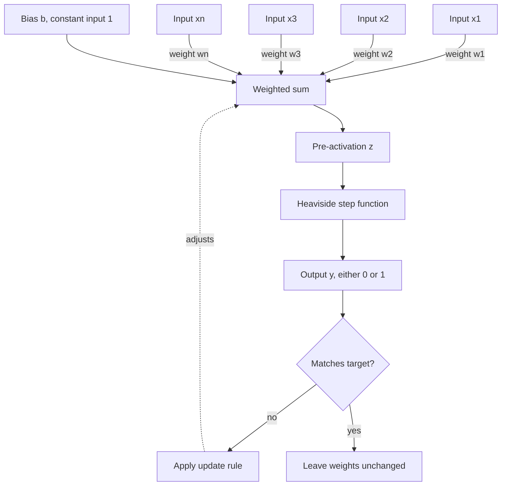
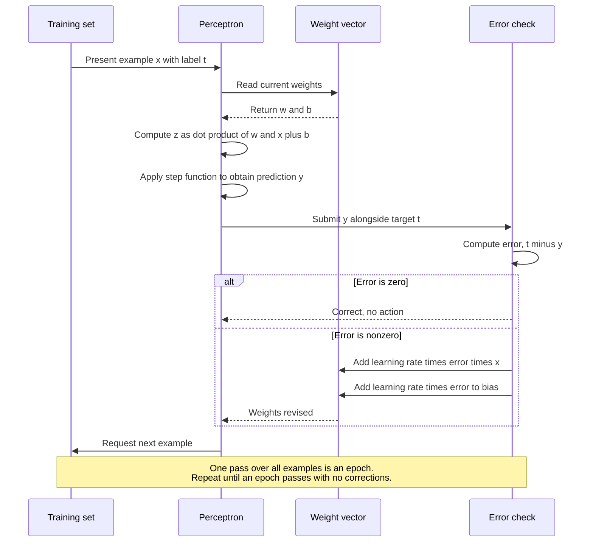
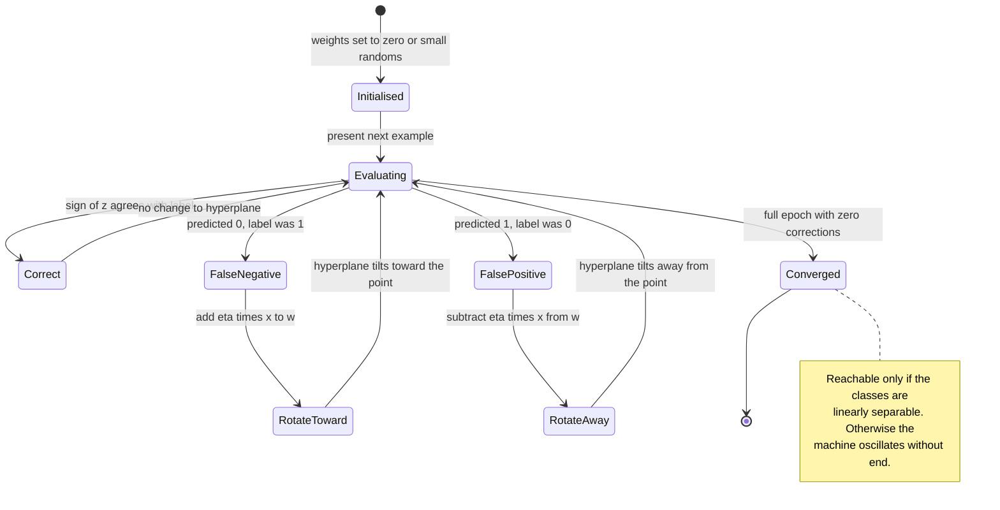

## Overview

The Perceptron addresses a problem that is easy to state and was, in 1957, remarkably difficult to solve: given a collection of measurements describing some object, decide automatically which of two categories that object belongs to, and arrive at the rule for deciding by inspection of examples rather than by the deliberate labour of a programmer. Prior to this the boundary between the two classes had to be specified in advance by whoever built the machine. The Perceptron proposed instead that the boundary be discovered, adjusted by the machine itself in response to its own errors.

Frank Rosenblatt, working at the Cornell Aeronautical Laboratory, formalised the device in a 1957 technical report and elaborated it in the 1958 paper [The Perceptron: A Probabilistic Model for Information Storage and Organization in the Brain](https://psycnet.apa.org/record/1959-09865-001). The framing was explicitly biological. Rosenblatt was not merely proposing a classifier but a hypothesis about how nervous tissue might store information: not as discrete engrams in particular cells, but as a distributed pattern of connection strengths across many cells at once. That the same mathematics turned out to underwrite an entire industry of pattern recognition was, in a sense, incidental to his purpose.

The mechanism is austere. Each input measurement is multiplied by a weight, the products are summed, a bias is added, and the resulting quantity is compared against zero. If it exceeds zero the machine answers in the affirmative; otherwise it does not. Learning consists of a single rule applied whenever the machine answers incorrectly: adjust each weight by a small amount proportional to the input that contributed to the error, in the direction that would have produced the correct answer. Nothing more is required. There is no gradient to compute, no loss surface to descend, no differentiable activation. The rule is arithmetic that a clerk could execute.

What elevates this from arithmetic curiosity to mathematical result is the convergence theorem, proved by Albert Novikoff in 1962 and discussed in most standard treatments including [Bishop's Pattern Recognition and Machine Learning](https://www.microsoft.com/en-us/research/publication/pattern-recognition-machine-learning/). If the two classes can be separated by any hyperplane whatsoever, the Perceptron learning rule will find such a hyperplane in a finite number of corrections, and the bound on that number depends only on the geometry of the data and not on the order in which examples are presented. This is a genuine guarantee, and guarantees of this kind were scarce in the field at the time. It is also, as the subsequent history makes clear, a guarantee with a conspicuous precondition attached.

The device retains its place in the canon for three reasons. First, it is the irreducible unit: a modern transformer with hundreds of billions of parameters is, at the level of the individual neuron, performing precisely the weighted sum described here, and the [PyTorch nn.Linear](https://pytorch.org/docs/stable/generated/torch.nn.Linear.html) module is a batched Perceptron without the threshold. Second, its failure is as instructive as its success, and the demonstration of that failure reorganised the field for fifteen years. Third, it establishes the pattern that all later training procedures follow, which is that a machine may improve by being shown its own mistakes.

## Architecture at a Glance



## Operational Flow



## Detailed Component Interaction

The update rule is best understood geometrically. The weight vector is the normal to the decision hyperplane, and each correction rotates that plane toward the misclassified point.



## Layer Breakdown

The Perceptron has exactly one layer, but that layer decomposes into three functional stages worth treating separately.

#### Linear Combination Stage

- **Purpose**: Project the input vector onto a learned direction in feature space.
- **Inputs and outputs**: Input of shape `(B, n_features)`, output of shape `(B, 1)`.
- **Learnable parameters**: Weight vector `w` of shape `(n_features,)`, bias scalar `b` of shape `(1,)`.
- **Key hyperparameters**: None. This stage is pure arithmetic.
- **Effective methods**: In practice the bias is folded into the weight vector by appending a constant `1` to every input, which reduces the update rule to a single expression. `numpy.dot(w, x)` or `torch.nn.functional.linear(x, w, b)` both suffice.

#### Threshold Stage

- **Purpose**: Convert a real-valued score into a categorical decision.
- **Inputs and outputs**: Input `(B, 1)`, output `(B, 1)` restricted to the set containing zero and one.
- **Learnable parameters**: None.
- **Key hyperparameters**: The threshold itself, conventionally zero once a bias term is present.
- **Effective methods**: `numpy.heaviside(z, 0)` gives the classical step. Note that this function has zero derivative everywhere it is defined, which is precisely why backpropagation cannot be applied to it and why the sigmoid replaced it in later work.

#### Correction Stage

- **Purpose**: Revise the weights in response to a misclassification.
- **Inputs and outputs**: Consumes the error scalar and the input vector; emits a weight delta of shape `(n_features,)`.
- **Learnable parameters**: None of its own.
- **Key hyperparameters**: Learning rate `eta`, a positive scalar. For a Perceptron with zero-initialised weights the choice of `eta` affects only the scale of the final weights and not the sequence of decisions, a property that does not survive into later architectures.
- **Effective methods**: `w += eta * (target - prediction) * x`. The [scikit-learn Perceptron](https://scikit-learn.org/stable/modules/generated/sklearn.linear_model.Perceptron.html) implements this with optional regularisation and early stopping.

## Core Equations

### The Decision Function

$$
y = H(\mathbf{w} \cdot \mathbf{x} + b) = H\left(\sum_{i=1}^{n} w_i x_i + b\right)
$$

| Symbol | Meaning |
|---|---|
| $y$ | The output decision, either zero or one |
| $H$ | The Heaviside step function, returning one for non-negative arguments and zero otherwise |
| $\mathbf{w}$ | The weight vector, one component per input feature |
| $\mathbf{x}$ | The input vector for a single example |
| $b$ | The bias, a learned offset independent of the input |
| $n$ | The number of input features |
| $w_i, x_i$ | The i-th component of the weight and input vectors respectively |

The decision (y) is obtained by taking each input feature (x sub i), multiplying it by its corresponding weight (w sub i), summing all such products across the full set of features (n), adding the bias (b) to that sum, and finally passing the result through the step function (H), which returns one when its argument is zero or greater and zero when it is less. The bias (b) permits the decision boundary to sit somewhere other than through the origin, which is necessary whenever the two classes are not symmetrically arranged about the centre of the feature space.

### The Learning Rule

$$
\mathbf{w}^{(t+1)} = \mathbf{w}^{(t)} + \eta \left( d - y \right) \mathbf{x}
$$

| Symbol | Meaning |
|---|---|
| $\mathbf{w}^{(t)}$ | The weight vector before this correction |
| $\mathbf{w}^{(t+1)}$ | The weight vector after this correction |
| $\eta$ | The learning rate, a small positive constant |
| $d$ | The desired output, the true label of the example |
| $y$ | The output the machine actually produced |
| $\mathbf{x}$ | The input vector of the example just misclassified |

The revised weights (w superscript t plus one) are obtained by taking the current weights (w superscript t) and adding to them the input vector (x) scaled by two quantities: the learning rate (eta), which governs how large a step is taken, and the error (d minus y), which is the difference between the desired label (d) and the produced output (y). Because both the desired label and the output are restricted to zero and one, the error (d minus y) can only take the values positive one, zero, or negative one. When it is zero no change occurs at all, which is to say the machine learns only from its mistakes. When it is positive one the input vector is added, tilting the decision boundary toward the example. When it is negative one the input vector is subtracted, tilting away.

### The Convergence Bound

$$
k \leq \left( \frac{R}{\gamma} \right)^{2}
$$

| Symbol | Meaning |
|---|---|
| $k$ | The total number of corrections made before convergence |
| $R$ | The radius of the smallest sphere centred at the origin containing every training example |
| $\gamma$ | The margin, the smallest distance from any example to the separating hyperplane |

The number of corrections (k) the machine will ever need to make is bounded above by the square of the ratio between the data radius (R) and the margin (gamma). The radius (R) measures how far the examples spread from the origin, and the margin (gamma) measures how comfortably the two classes are separated. The bound therefore says something intuitive: widely spread data with a narrow gap between the classes takes longer to learn than tightly clustered data with a generous gap. Crucially the bound contains no reference to the number of examples or to the order of their presentation, and it is finite whenever a positive margin (gamma) exists at all.

## Complexity Analysis

| Measure | Value |
|---|---|
| Time complexity, single prediction | O(n) where n is the number of features |
| Time complexity, full training | O(k n) where k is bounded by the ratio of R squared to gamma squared |
| Space complexity | O(n), one weight per feature plus a single bias |
| Typical parameter count | n plus 1. For the Mark I hardware with its 400 photocells, 401 parameters |
| Typical FLOPs per forward pass | 2n, comprising n multiplications and n additions, plus one comparison |

## Strengths and Limitations

**Strengths**

- Convergence in finite time is guaranteed whenever the classes are linearly separable, with an explicit bound.
- The update rule is online. Examples may arrive one at a time and need never be stored.
- Memory cost is linear in the feature count and independent of the size of the training set.
- The learned weights are directly interpretable as feature importances, a property largely lost in deeper models.
- Implementation requires no calculus, no matrix inversion, and no numerical libraries.

**Limitations**

- It can represent only linearly separable functions. The exclusive-or relation, requiring just two inputs, lies beyond it.
- On non-separable data the procedure does not converge and does not degrade gracefully; it oscillates indefinitely, and the weights at any arbitrary stopping point carry no guarantee of quality.
- The step function has a derivative of zero wherever it is differentiable, which forecloses gradient-based training and therefore forecloses stacking into deep networks.
- It finds some separating hyperplane, not the best one. The margin-maximising solution requires the support vector machine.
- The binary output supplies no measure of confidence, only a verdict.

## Key Milestones

- **1943** - [A Logical Calculus of the Ideas Immanent in Nervous Activity](https://link.springer.com/article/10.1007/BF02478259) by McCulloch and Pitts establishes the threshold neuron as a formal object, though without any learning procedure.
- **1949** - Donald Hebb's *The Organization of Behavior* proposes that co-active cells strengthen their connection, supplying the conceptual precursor to the update rule.
- **1957** - Rosenblatt's Cornell Aeronautical Laboratory report introduces the Perceptron proper and its learning algorithm.
- **1958** - [The Perceptron: A Probabilistic Model](https://psycnet.apa.org/record/1959-09865-001) appears in *Psychological Review*, bringing the device to a wide scientific readership.
- **1960** - The [Mark I Perceptron](https://americanhistory.si.edu/collections/search/object/nmah_334414) is completed, a physical machine with a 20 by 20 grid of photocells and weights held in motor-driven potentiometers. Widrow and Hoff independently introduce ADALINE with a continuous-valued error signal.
- **1962** - Novikoff publishes the convergence proof, converting an empirical procedure into a theorem.
- **1969** - [Perceptrons](https://mitpress.mit.edu/9780262534772/perceptrons/) by Minsky and Papert demonstrates the exclusive-or limitation rigorously. Funding contracts, and the first winter begins.
- **1986** - Backpropagation, popularised by Rumelhart, Hinton, and Williams, resolves the limitation by stacking differentiable units. See [Multilayer Perceptron](/received-canon/foundational/multilayer-perceptron/).

## Reference Material

A minimal implementation, complete and dependency-light:

```python
import numpy as np


class Perceptron:
    """Rosenblatt's Perceptron with the classical update rule."""

    def __init__(self, n_features, eta=0.01, max_epochs=100):
        self.w = np.zeros(n_features)
        self.b = 0.0
        self.eta = eta
        self.max_epochs = max_epochs

    def predict(self, x):
        return np.heaviside(np.dot(self.w, x) + self.b, 1).astype(int)

    def fit(self, X, y):
        for epoch in range(self.max_epochs):
            corrections = 0
            for xi, target in zip(X, y):
                error = target - self.predict(xi)
                if error != 0:
                    self.w += self.eta * error * xi
                    self.b += self.eta * error
                    corrections += 1
            if corrections == 0:
                return epoch + 1
        return None  # did not converge; data may not be separable
```

Demonstrating both the success and the famous failure:

```python
# AND is linearly separable and converges quickly.
X_and = np.array([[0, 0], [0, 1], [1, 0], [1, 1]])
y_and = np.array([0, 0, 0, 1])

p = Perceptron(n_features=2, eta=0.1)
epochs = p.fit(X_and, y_and)
print(f"AND converged after {epochs} epochs, weights {p.w}, bias {p.b:.2f}")

# XOR is not, and no number of epochs will suffice.
y_xor = np.array([0, 1, 1, 0])
q = Perceptron(n_features=2, eta=0.1, max_epochs=10000)
print("XOR converged:", q.fit(X_and, y_xor) is not None)  # False
```

The equivalent using established libraries, for production work:

```python
from sklearn.linear_model import Perceptron as SkPerceptron
import torch
import torch.nn as nn

# scikit-learn, with regularisation and early stopping available
clf = SkPerceptron(eta0=0.1, max_iter=1000, tol=1e-3, random_state=0)
clf.fit(X_and, y_and)
print("sklearn coefficients:", clf.coef_, "intercept:", clf.intercept_)

# The same linear stage in PyTorch. Note that nn.Linear is the Perceptron's
# combination stage batched across examples; only the threshold is absent.
layer = nn.Linear(in_features=2, out_features=1)
scores = layer(torch.tensor(X_and, dtype=torch.float32))
decisions = (scores > 0).int()
print("torch decisions:", decisions.flatten().tolist())
```

Further reading: the [Deep Learning textbook](https://www.deeplearningbook.org/) by Goodfellow, Bengio, and Courville places the Perceptron in its modern setting, and the [scikit-learn linear models guide](https://scikit-learn.org/stable/modules/linear_model.html) covers the relationship between the Perceptron, logistic regression, and the support vector machine.

## Relations and Historicity

The Perceptron's lineage begins with the McCulloch and Pitts neuron of 1943, which supplied the threshold unit but no means of setting its weights, and with Hebb's 1949 proposal that connection strength should rise with correlated activity. Rosenblatt's contribution was to make the weights adjustable by an explicit and terminating procedure, and to attach to that procedure a proof. It is worth noting that the Mark I was not a simulation but a physical apparatus: weights were stored as the shaft positions of motor-driven potentiometers, and learning was audible. The distinction between a model of computation and a machine that computes was, in 1960, considerably less abstract than it has since become.

The device's descent was as consequential as its ascent. Minsky and Papert's *Perceptrons* of 1969 established with precision that a single-layer machine cannot compute the exclusive-or relation, since no straight line separates the two positive cases from the two negative ones. The mathematics was correct and, taken narrowly, uncontroversial. Its reception was not. The book was widely read as an indictment of the connectionist programme in general rather than of the single-layer case in particular, and government funding for neural network research contracted sharply through the 1970s. Rosenblatt himself had described multilayer arrangements in his earlier work and was aware that depth changed the picture; what nobody yet possessed was a procedure for training those deeper arrangements. He died in a boating accident in 1971 and did not see the question resolved.

Resolution arrived through a substitution so small it is easy to underestimate: replace the step function with a differentiable one, and the chain rule becomes applicable through arbitrarily many layers. This is the whole of the insight behind [Backpropagation](/received-canon/foundational/backpropagation/), and it converts the Perceptron from a terminal object into a building block. Every architecture in this volume inherits from it directly. The convolutional filter is a Perceptron with shared weights and restricted receptive field. The attention head computes weighted sums that are Perceptrons in all but name. Even the mixture-of-experts router, deciding which sub-network shall receive a token, is performing the same thresholded linear judgement Rosenblatt's potentiometers performed sixty-odd years ago. The field did not move past the Perceptron. It learned how to stack it.

## See Also

- [Multilayer Perceptron](/received-canon/foundational/multilayer-perceptron/) - the resolution of the exclusive-or limitation through depth
- [Backpropagation](/received-canon/foundational/backpropagation/) - the training procedure that made depth tractable
- [Hopfield Network](/received-canon/foundational/hopfield-network/) - a contemporaneous alternative treating memory as energy minimisation
- [Convolutional Neural Network](/received-canon/convolutional/convolutional-neural-network/) - weight sharing applied to the same linear unit
